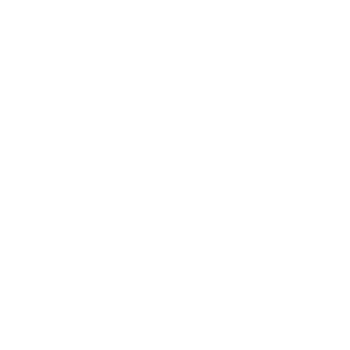
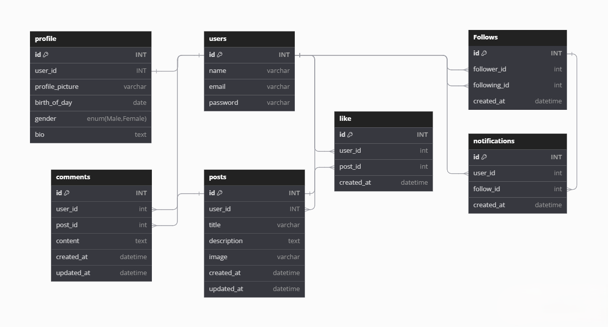

# Nama Project
Project kami adalah <a href="http://postbox.free.nf/"><b>PostBox</b></a> `
<a href="http://postbox.free.nf/">[http://postbox.free.nf/]</a>

# Nama Anggota
<ul>
<li><a href="https://github.com/El-Idrisi">Muhammad El-Idrisi</a></li>
<li><a href="https://github.com/MuhammmadFahry">Muhammad Fa'hriyansah</a></li>
<li><a href="https://github.com/mtaufik31">Muhammad Taufik Budiman</a></li>
<li><a href="https://github.com/tiaraanandapurwito">Tiara Ananda Purwito</a></li>
</ul>

# Link Video Presentasi

# Gambar ERD

# Penjelasan Project

PostBox adalah platform media sosial yang memungkinkan user untuk terhubung, berbagi, dan berinteraksi satu sama lain melalui postingan, komentar, dan like.

## Gambaran Umum Proyek

PostBox dirancang untuk menyediakan antarmuka yang mudah digunakan untuk jejaring sosial. User dapat membuat profil pribadi, berbagi postingan, mengikuti user lain, dan berinteraksi dengan konten melalui like dan komentar.

## Fitur Utama

1. **Manajemen Profil**: User dapat membuat dan mengedit profil mereka, termasuk foto profil dan informasi biodata.
2. **Post Creation**: User dapat membuat postingan teks dengan unggahan gambar opsional.
3. **Interaksi Sosial**: User dapat melakukan interaksi sosial:
   - Menyukai postingan
   - Mengomentari postingan
   - Follow/Unfollow user lain
4. **Notifikasi**: User menerima notifikasi untuk pengikut baru.
5. **Fungsi Pencarian**: User dapat mencari user lain.

## Alur Pengguna

1. **Pendaftaran/Login**: User baru dapat mendaftar, sementara user yang sudah ada dapat masuk.
2. **Penyiapan Profil**: Setelah pendaftaran, user dapat mengatur profil mereka dengan informasi pribadi dan gambar profil.
3. **Penjelajahan**: User dapat menelusuri umpan berita mereka untuk melihat kiriman dari user yang mereka ikuti.
4. **Interaksi**: User dapat menyukai postingan, memberikan komentar, dan mengikuti user lain.
5. **Kreasi Konten**: User dapat membuat postingan mereka sendiri, berbagi pemikiran atau gambar dengan para pengikut mereka.
6. **Notifikasi**: User menerima pemberitahuan tentang pengikut baru, meningkatkan keterlibatan.

## Teknologi

- Backend Laravel 
- Frontend: Mesin templating Blade dengan JavaScript
- Basis data: MySQL
- Otentikasi: Sistem autentikasi bawaan Laravel
- Alert: Library dari JavaScript - SweetAlert2

